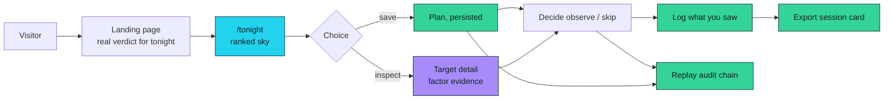
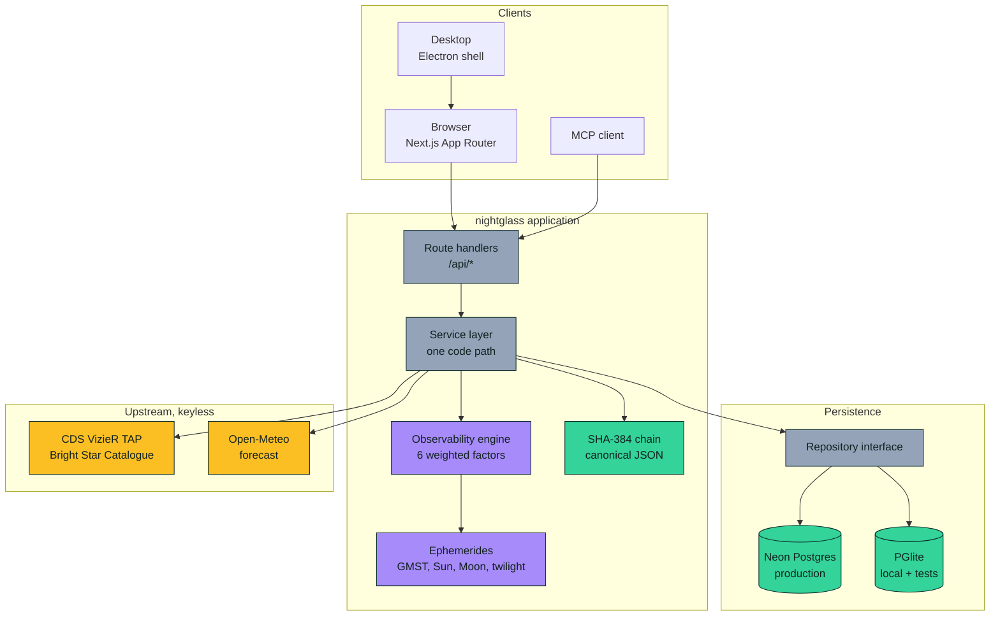
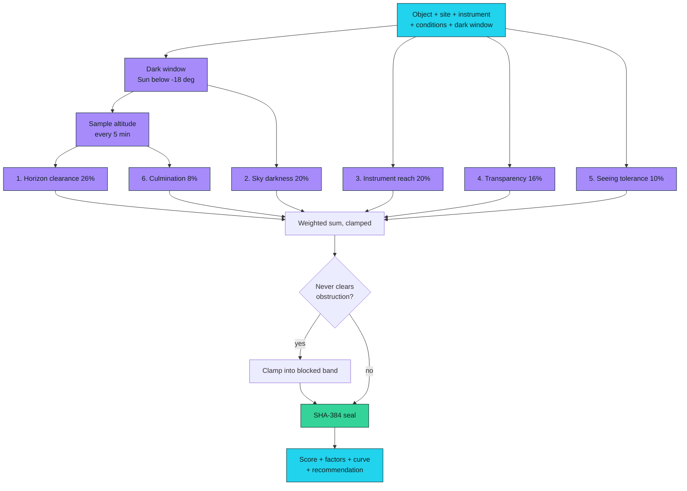
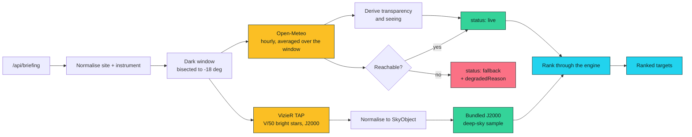
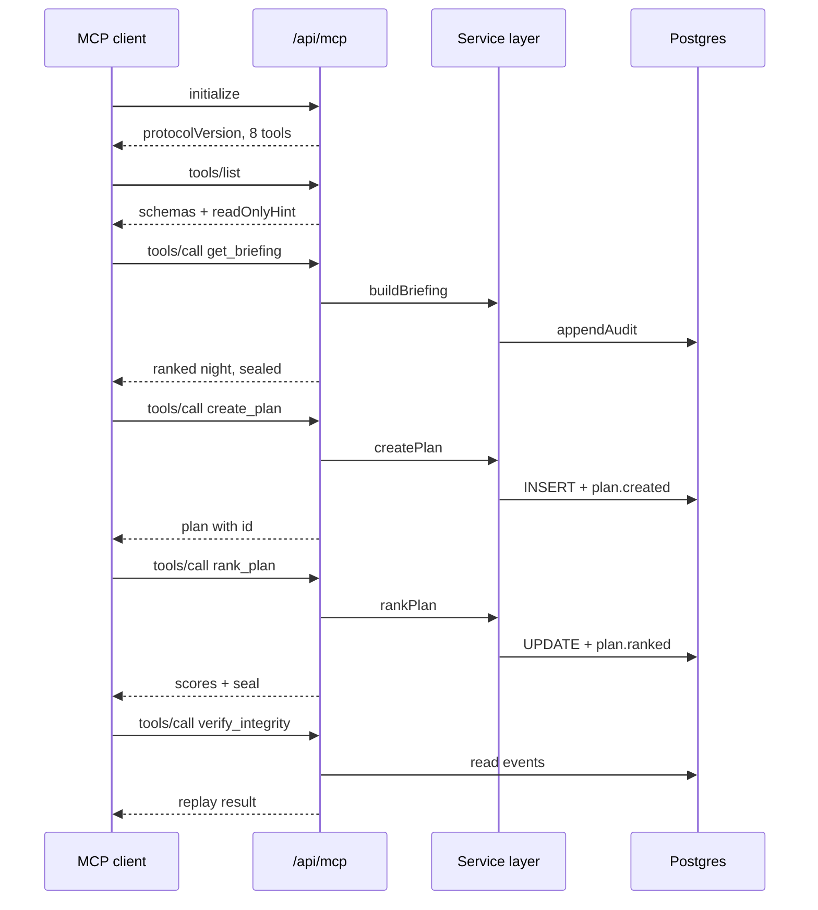
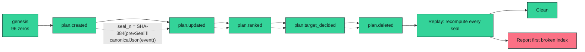
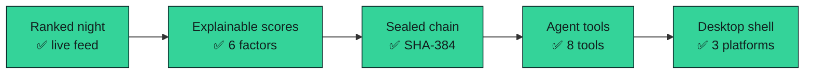
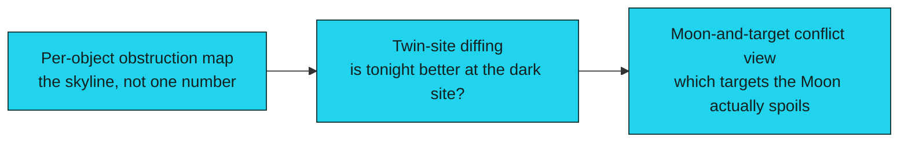
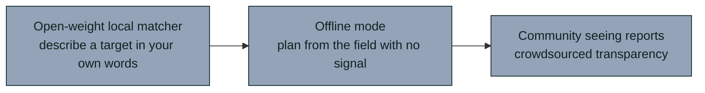

# nightglass

<div align="center">

**Know what is worth observing tonight, and why.**

[](https://nightglass-aniruddha-adaks-projects.vercel.app)
[](LICENSE)
[](https://nextjs.org)
[](https://www.typescriptlang.org)
[](https://neon.tech)
[](https://nightglass-aniruddha-adaks-projects.vercel.app/api/mcp)

[Live App](https://nightglass-aniruddha-adaks-projects.vercel.app) · [GitHub](https://github.com/aniruddhaadak80/nightglass) · [API](https://nightglass-aniruddha-adaks-projects.vercel.app/api/health) · [Agent](https://nightglass-aniruddha-adaks-projects.vercel.app/agent) · [Issues](https://github.com/aniruddhaadak80/nightglass/issues)

</div>

---

Most observing plans fail on arithmetic nobody did. The target never clears the
trees. The Moon is full behind it. It is simply too faint for the aperture you
own, and you only find out after an hour of frostbite.

**nightglass does that arithmetic in the open.** It pulls the real star and
deep-sky catalogue, reads live cloud and transparency for your exact
coordinates, integrates your target's true altitude across the astronomical
night, and ranks tonight's sky against your real horizon and your real
instrument. Every score shows the measurement behind it, and every score is
sealed into a replayable SHA-384 chain.

It runs in a browser and as a desktop app for macOS, Windows and Linux.

---

## ✨ Features

**Know what clears your trees.** Tell it how high your obstruction is. The
altitude curve is sampled across the real astronomical night and anything below
that angle is hatched out rather than quietly ignored. Drag the slider and the
whole ranking re-cuts, because the frame *is* the value the engine scored against.

**Surface brightness, not just magnitude.** A magnitude 9 object spread over
three degrees is a different night out from a compact magnitude 9 knot. The
reach factor splits its weighting on angular size, because integrated magnitude
alone would call both easy.

**Two keyless live sources.** Bright-star positions come from the CDS Bright Star
Catalogue via the VizieR TAP protocol, and conditions from Open-Meteo. Neither
needs a key, and neither is mocked. When an upstream fails the response is
labelled `fallback` with the reason — never dressed up as live.

**Scores you can check.** Six weighted factors, each carrying the measured
quantity behind it. Sidereal time from the standard GMST series, the Sun from the
NOAA solar algorithm, the Moon from Meeus's truncated ELP series, refraction from
Bennett. Twilight edges are bisected onto the exact −18° crossing.

**An agent that can actually plan a night.** A live MCP JSON-RPC 2.0 endpoint
with eight tools — read a night, search the catalogue, score an object, create a
plan, decide a target, log an observation, replay the chain. Every mutating tool
goes through the same service function the browser UI calls.

**A real desktop app.** The Electron shell adds a tray, native notifications when
a target reaches its best altitude, and a native Save dialog for the session
card. The engine stays on the server, so the two builds cannot drift apart.

---

## 🗺️ What it does



---

## 🚀 Quickstart

```bash
git clone https://github.com/aniruddhaadak80/nightglass
cd nightglass
npm install
npm run dev
```

Open <http://localhost:3000>.

**Zero required environment variables.** With no `DATABASE_URL` the application
uses an embedded PGlite database, so there is nothing to install and nothing to
sign up for. The same adapter runs the test suite.

For a real deployment, set the variables in [`.env.example`](.env.example):

| Variable | Required | Purpose |
| --- | --- | --- |
| `DATABASE_URL` | In production only | Hosted Postgres. `POSTGRES_URL` is also accepted, because that is what the Neon and Vercel marketplace integrations provide. |
| `DATABASE_SCHEMA` | No | Namespace tables when sharing one Postgres instance. Must be a plain lowercase identifier. |
| `SITE_URL` | No | Canonical origin for metadata, OpenGraph, the sitemap and `mcp.json`. |

In production the application **refuses to start** without `DATABASE_URL` rather
than silently using an embedded database, which would lose every saved plan on
the next cold start.

```bash
npm run check        # typecheck, lint, test, build
npm run verify:live  # the full journey against a running deployment
BASE_URL=https://nightglass-aniruddha-adaks-projects.vercel.app npm run verify:live
```

---

## 🏗️ Architecture



The service layer is the important line in that diagram. The browser UI, the REST
routes and the MCP tools all call the same functions, so the audit chain and the
score cannot disagree between surfaces.

---

## 🔭 The engine

Six factors, weights summing to exactly 1, so the score reads directly as
"this many points came from that".



| Factor | Weight | What it measures |
| --- | --- | --- |
| Horizon clearance | 0.26 | How long, and how high, the target stays above your obstruction |
| Sky darkness | 0.20 | Sun depth, light pollution from your Bortle class, Moon interference |
| Instrument reach | 0.20 | Magnitude and surface brightness against your aperture's limit |
| Transparency | 0.16 | Live cloud by layer and horizontal visibility |
| Seeing tolerance | 0.10 | Whether the target's angular size survives unsteady air |
| Culmination | 0.08 | The closed form 90° − \|lat − dec\| |

Two decisions worth calling out, because the obvious alternatives are wrong:

**Surface brightness splits the reach factor.** Objects larger than three
arcminutes are scored 0.7 on surface brightness and 0.3 on magnitude, because
that is what actually limits visual detection of extended objects. A galaxy
comfortably inside the magnitude limit can still be invisible.

**Seeing uses a floor plus a power law, not a product.** The obvious
`tolerance × air` formula gives a large target a higher baseline, so the same
gust costs it *more* points than a small one. That is backwards. A globular
cluster in mediocre seeing is still a globular cluster.

**A hard horizon gate.** If a target never rises above your stated obstruction the
score is clamped into the blocked band and flagged `gated`, however clear the
night. Ungated, a beautifully transparent night would score a treeless target
"fair" on transparency alone — exactly the wrong answer for someone standing under
a tree.

---

## 📡 Data pipeline and fallback



Conditions are averaged across the **whole** dark window rather than sampled at
one hour. A clear hour after three cloudy hours is not a clear night.

Deep-sky positions ship as a curated J2000 sample rather than being fetched. The
obvious move was to pull VizieR's NGC/IC table, but it stores pre-J2000
positions and its `RA1975`/`DE19750` columns did not round-trip against known
objects when checked — so shipping it would have meant publishing coordinates
that could not be verified. The Bright Star Catalogue stores J2000 directly and
verified exactly against reference values for Sirius, Canopus and Arcturus.

---

## 🤖 Agent interface



Mutating tools are idempotent where that is meaningful: a repeated
`log_observation` for the same object and date returns the existing entry instead
of creating a second one, and `create_plan` honours an `idempotencyKey`.

Try it live from the [`/agent`](https://nightglass-aniruddha-adaks-projects.vercel.app/agent) page, or
point any MCP client at the endpoint:

```json
{
  "mcpServers": {
    "nightglass": {
      "type": "http",
      "url": "https://nightglass-aniruddha-adaks-projects.vercel.app/api/mcp"
    }
  }
}
```

---

## 🔐 Integrity



Canonical JSON sorts object keys recursively, so the byte representation does not
depend on property insertion order — that is what makes replay meaningful across
processes and machines. Deletions are soft: a tombstone event is appended and the
row flagged, so a chain still replays cleanly after a delete.

The digest is pinned by a test against a hand-computed vector, so a change to key
ordering or the concatenation order fails the suite instead of silently
invalidating every previously exported session card.

---

## 🔌 API

Everything is scoped to the anonymous session cookie. There are no accounts.

```bash
BASE=https://nightglass-aniruddha-adaks-projects.vercel.app

# Health — verifies the real persistence path, not a static object
curl -s $BASE/api/health

# One night, ranked
curl -s "$BASE/api/briefing?lat=40&lon=-3&bortle=5&horizon=12"

# Create a plan
curl -s -c jar -X POST $BASE/api/plans \
  -H 'content-type: application/json' \
  -d '{
    "name": "Clear night",
    "nightOf": "2026-10-06",
    "site": {"name":"Field","latitudeDeg":40,"longitudeDeg":-3,"bortle":5,"horizonDeg":12,"timezone":"UTC"},
    "instrument": {"name":"200 mm","apertureMm":200,"magnification":120,"type":"reflector"},
    "targets": [{"objectId":"sample:M42","name":"Orion Nebula","kind":"nebula","magnitude":4,"decision":"pending","note":""}]
  }'

# Read it back, then run the engine over it
curl -s -b jar $BASE/api/plans/$PLAN_ID
curl -s -b jar -X POST $BASE/api/plans/$PLAN_ID/rank

# Decide, and confirm the decision persisted
curl -s -b jar -X POST $BASE/api/plans/$PLAN_ID/targets/sample%3AM42 \
  -H 'content-type: application/json' -d '{"decision":"observe"}'

# Export the session card
curl -s -b jar -OJ "$BASE/api/export?planId=$PLAN_ID"

# Replay the audit chain
curl -s -b jar "$BASE/api/verify?planId=$PLAN_ID"

# Delete; the tombstone keeps the chain replayable
curl -s -b jar -X DELETE $BASE/api/plans/$PLAN_ID
```

The full journey, including the MCP mutation path, is asserted end to end:

```bash
BASE_URL=https://nightglass-aniruddha-adaks-projects.vercel.app npm run verify:live
```

---

## 📁 Project map

| Route | What it does |
| --- | --- |
| `/` | Landing page. The headline verdict is a real computation for a default site. |
| `/tonight` | Workspace: ranked targets, the obstruction slider, per-target evidence. |
| `/plans/[id]` | Dynamic plan detail: persisted scores, decisions, logged observations. |
| `/catalogue` | The catalogue, with source attribution and live/fallback status. |
| `/log` | Full CRUD over what you actually saw. |
| `/method` | Exactly how a score is produced, and what it does not do. |
| `/agent` | Live MCP console with one-click calls and real responses. |
| `/export` | Saved plans and the session card download. |
| `/settings` | Site and instrument, stored in local storage only. |
| `/verify` | Chain replay with the first broken link, if any. |

| API route | Methods |
| --- | --- |
| `/api/health` | `GET` |
| `/api/briefing` | `GET` |
| `/api/catalogue` | `GET` |
| `/api/plans` | `GET`, `POST` |
| `/api/plans/[id]` | `GET`, `PATCH`, `DELETE` |
| `/api/plans/[id]/rank` | `POST` |
| `/api/plans/[id]/targets/[objectId]` | `POST` |
| `/api/observations` | `GET`, `POST` |
| `/api/observations/[id]` | `GET`, `PATCH`, `DELETE` |
| `/api/export` | `GET` |
| `/api/verify` | `GET` |
| `/api/mcp` | `GET`, `POST` |

| Module | Responsibility |
| --- | --- |
| `src/lib/astro.ts` | Ephemerides, sidereal time, horizon geometry, twilight |
| `src/lib/engine.ts` | The observability score and its six factors |
| `src/lib/integrity.ts` | Canonical JSON and the SHA-384 chain |
| `src/lib/repository.ts` | Neon and PGlite behind one interface |
| `src/lib/service.ts` | The only code path for create, rank, decide, log, export |
| `src/lib/feed.ts` | Open-Meteo and VizieR, with honest fallback labelling |
| `src/lib/catalogue.ts` | Bundled J2000 sample and the normalisation contract |
| `desktop/main.cjs` | Electron shell: tray, notifications, native save |

---

## 🖥️ Desktop app

The desktop build wraps the same deployed application rather than reimplementing
it, so the two cannot drift. It adds what a web page cannot do:

- tray icon with quick navigation
- native OS notifications when a target reaches its best altitude
- native Save dialog for the session card
- persisted window geometry
- `Ctrl`/`Cmd`+`Shift`+`N` back to tonight

```bash
npm install --save-dev electron electron-builder
npm run desktop:pack   # unpacked build for the current platform
npm run desktop:dist   # installers for the current platform
```

A macOS `.dmg` cannot be cross-built from Linux, so all three installers are
produced by [`.github/workflows/desktop.yml`](.github/workflows/desktop.yml) on
their own runners. Trigger it from the Actions tab or push a `v*` tag.

---

## 🔒 Security

- Anonymous ownership via an HTTP-only, `SameSite=Lax` cookie holding 24 random
  bytes. The server never trusts an owner id from a request body.
- A plan belonging to another session returns `404`, not `403`, so ids cannot be
  probed for existence.
- Every query is parameterised. The one interpolated value, the schema name, is
  validated against a strict identifier pattern.
- No `dangerouslySetInnerHTML` anywhere; no rendering of untrusted HTML.
- The Electron renderer runs with `contextIsolation`, `sandbox` and
  `nodeIntegration: false`, and the preload exposes exactly three methods.
- Anonymous writes are budgeted per session (40 per 60 s). **This is best-effort
  on serverless** — it is per instance and resets on cold start. A deployment
  that cares should put a hosted rate limiter in front of the write routes.

See [SECURITY.md](SECURITY.md).

---

## 📊 Attribution

| Source | Used for |
| --- | --- |
| [Open-Meteo](https://open-meteo.com/) | Cloud cover by layer, visibility, wind, humidity |
| [CDS VizieR — Bright Star Catalogue (V/50)](https://cdsarc.cds.unistra.fr/ftp/cats/V/50/) | Live bright-star positions and magnitudes, J2000 |
| Meeus, *Astronomical Algorithms* | Sidereal time, lunar ephemeris, twilight |
| NOAA solar position algorithm | Solar declination and right ascension |

Deep-sky positions ship as a curated J2000 sample inside the repository.

---

## 🗺️ Roadmap

**Now** — shipped in v1.0.0.



**Next** — each of these solves a real problem, not a demo.



- **Per-object obstruction.** Right now one number describes your whole skyline.
  A real observer wants a compass profile, because the east is often more open
  than the north.
- **Twin-site diffing.** "Is tonight better at the dark site 40 minutes away?"
  is the most common real question, and the engine can already answer it twice.
- **Moon conflict view.** Show, per target, how much of the score the Moon is
  actually costing you and when it clears.

**Later** — genuinely speculative.



- **Open-weight local matcher.** Transformers.js is already a dependency; the
  missing piece is a genuinely useful retrieval task, not a checkbox.
- **Offline mode.** The desktop shell could ship the catalogue and run the engine
  locally, so a plan works in a field with no signal.
- **Community seeing reports.** Transparency is currently estimated from wind.
  Real measurements from other observers would beat that, and the integrity chain
  already gives a way to trust them.

---

## ⚠️ A note on accuracy

nightglass is a **planning aid**. Times and altitudes are computed from real
ephemerides and are accurate to well under a degree, but they do not replace
looking up. It does not model local light pollution beyond the Bortle class you
enter, it estimates seeing from wind rather than measuring it, and it knows only
the single obstruction angle you give it.

Never point equipment at anything without checking the sky.

---

## 📄 Licence

MIT © [aniruddhaadak80](https://github.com/aniruddhaadak80)